**※해당 문서는 아무것도 모르는 분들을 위해 최대한 자세하게 작성 했습니다.**


 

- 목차
    - [1. 구글 클라우드 설정 방법](#구글-클라우드-설정하기)
    - [2. firebase 설정 하기](#firebase-설정하기)


----
### 구글 클라우드 설정하기.
 [`구글 클라우드 바로가기`](https://cloud.google.com/?hl=ko)

해당 구글 클라우드 접속을 한다.


- Agent Platform 클릭

 


- Google Cloud 옆에 클릭


- 새 프로젝트 만들기 클릭


- 설정 후 만들기 클릭


- API 및 서비스 클릭


- 사용자 인증 정보 클릭


- 사용자 인증 정보 만들기 클릭


- OAuth 클라이언트 ID 클릭


- 동의 화면 구성 클릭


- 시작하기 클릭


- 『 앱 이름 』설정 후 사용자 『 이메일 지정 』 다음 클릭

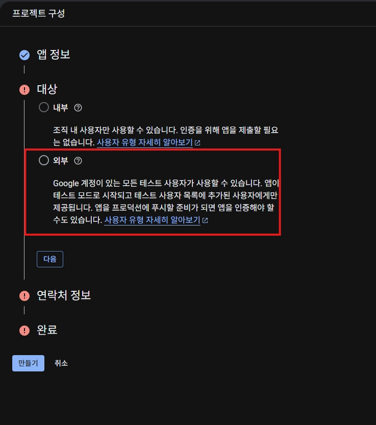

- 나는 외부 설정함.

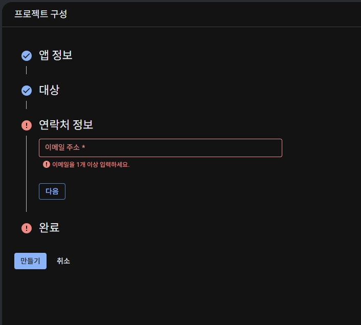

- 이메일 등록 후 다음 클릭

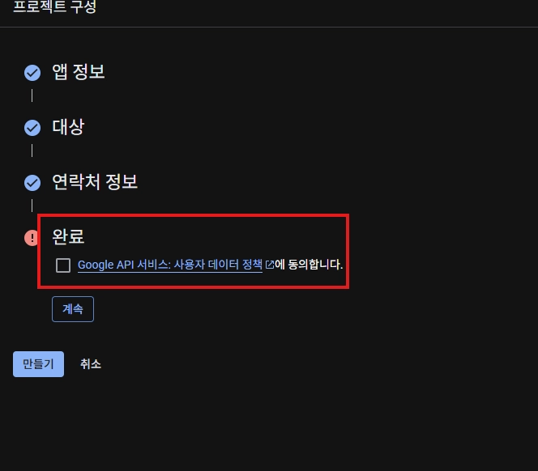

- 완료  체크 후 계속 클릭

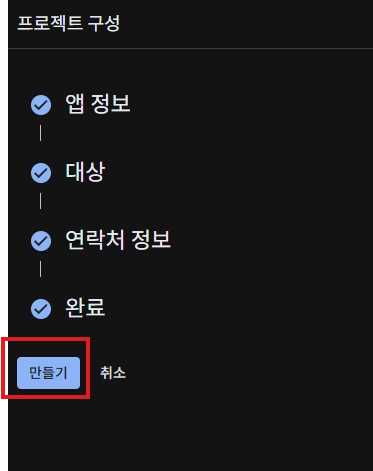

- 완료 후 만들기 클릭

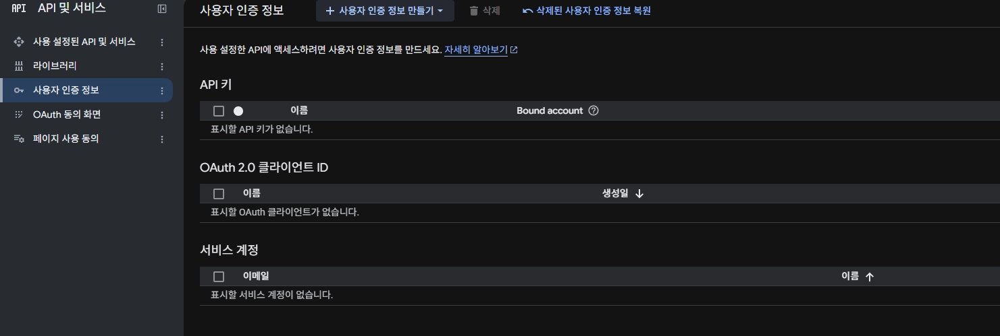

- 다시 사용자 인증 정보로 돌아오기.

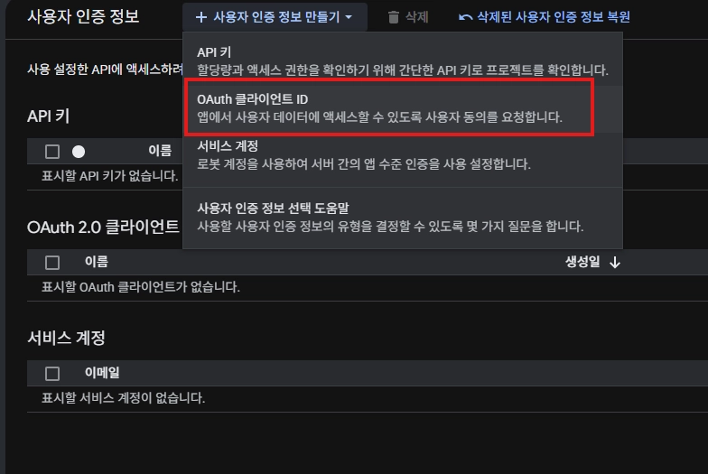

- OAuth 클라이언트 ID 클릭

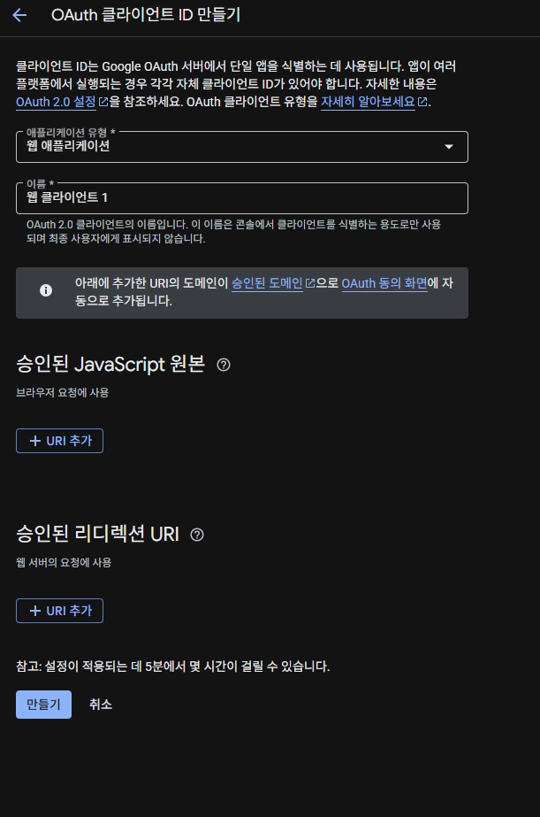
- 승인된 리디렉션 url 추가해야함.
- 『 http://127.0.0.1:7123/ 』 추가

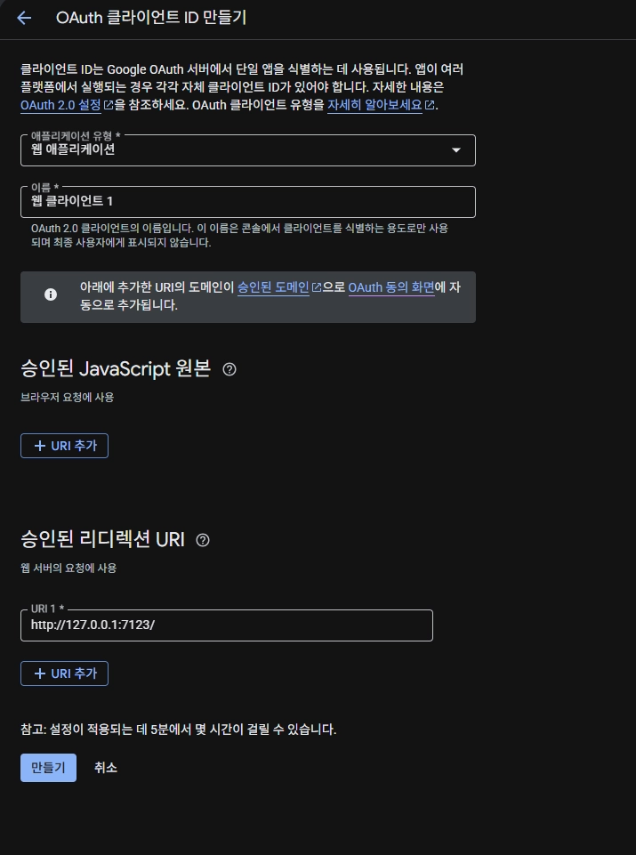

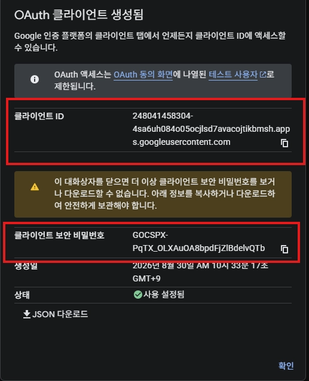

기억 해둬여 할 클라이언트 ID / 클라이언트 보안 비밀번호 기억 또는 저장 해둬야함.

### ※여기까지가  구글 클라우드 설정※

---
# firebase 설정하기.
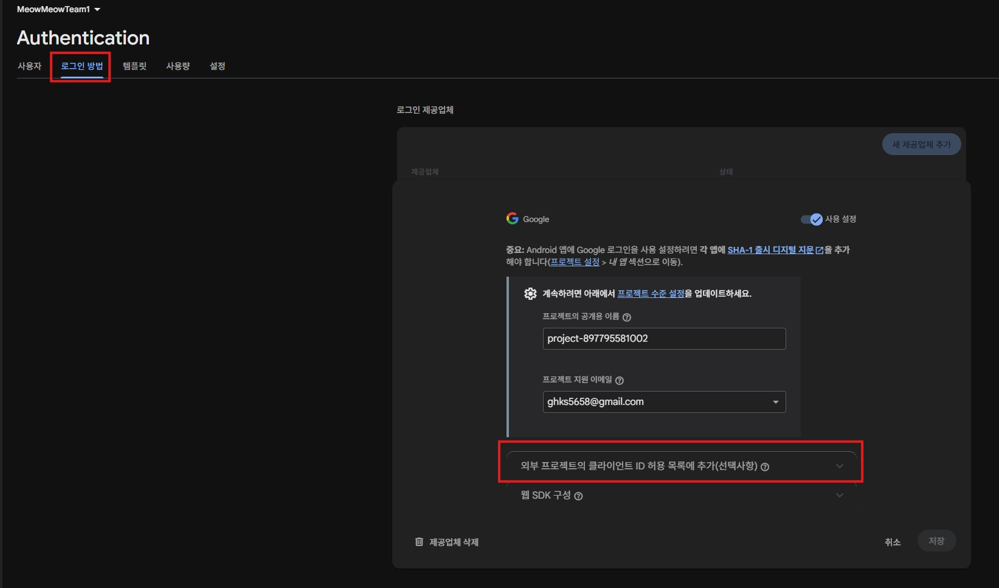

- firebase로 가서 Auth에 로그인 방법에 구글 사용처리 후
- 외부 프로젝트의 클라이언트 ID허용 목록에 추가 클릭  
(Auth에 구글 로그인 사용처리 해야 설정가능. ) 
 
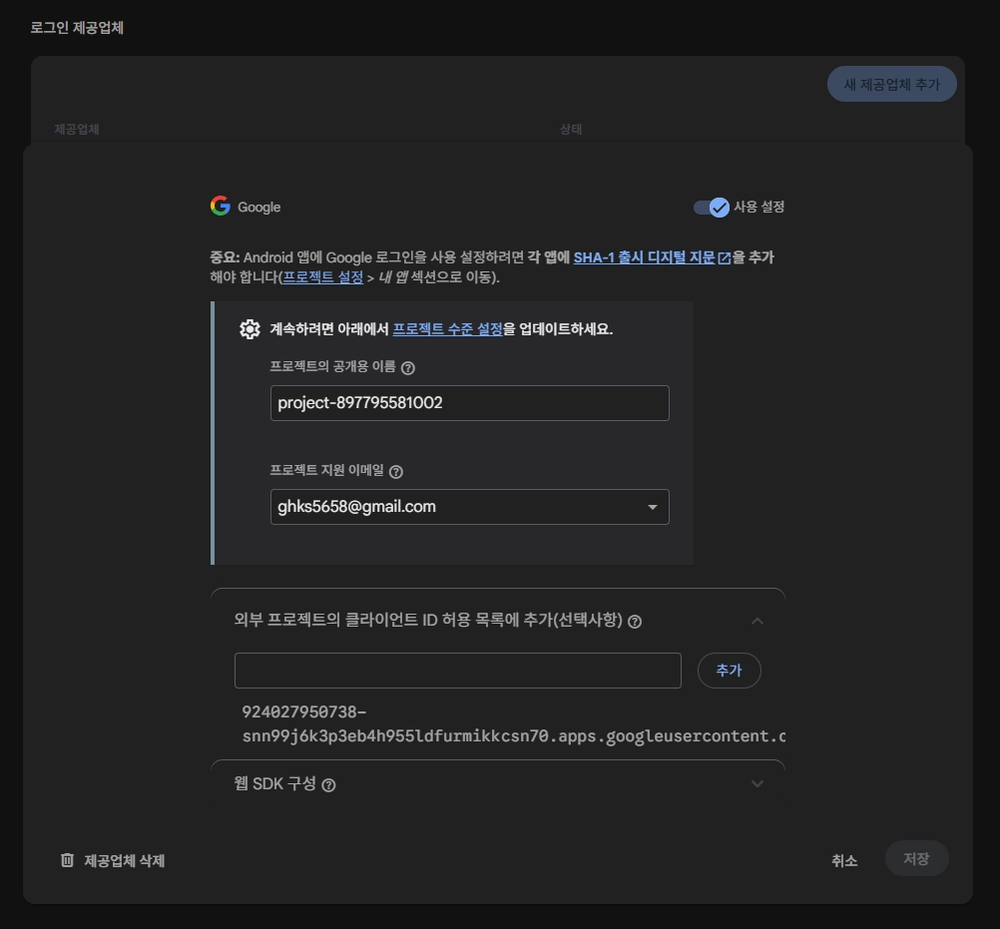

- 아까 저장해둔  구글 클라우드 ID 삽입
- 구글 회원가입 / 자동로그인  코드
    
    ```csharp
    using System;
    using System.IO;
    using System.Net;
    using System.Net.Sockets;
    using System.Text;
    using System.Threading.Tasks;
    using UnityEngine;
    using Firebase.Auth;
    
    public class GoogleTokenFetcher : MonoBehaviour
    {
        [Header("Firebase Web Client Credentials")]
        [Tooltip("GCP 콘솔의 웹 애플리케이션 클라이언트 ID")]
        [SerializeField] private string webClientId = "여기에_웹_클라이언트_ID_입력";
    
        [Tooltip("GCP 콘솔의 웹 애플리케이션 클라이언트 보안 비밀번호")]
        [SerializeField] private string webClientSecret = "여기에_웹_클라이언트_보안_비밀번호_입력";
    
        // redirect_uri_mismatch 방지를 위한 고정 포트 설정
        private const int LocalPort = 7123;
    
        private FirebaseAuth auth;
    
        private void Start()
        {
            auth = FirebaseAuth.DefaultInstance;
        }
    
        [ContextMenu("Get Google Token & Firebase Auth Test")]
        public async void GetGoogleToken()
        {
            Debug.Log("1. 구글 로그인 웹 브라우저를 엽니다...");
    
            TokenResponse tokenData = await FetchTokenFromGoogleAsync();
    
            if (tokenData != null && !string.IsNullOrEmpty(tokenData.id_token))
            {
                Debug.Log("<color=green><b>[구글 토큰 발급 성공!]</b></color>");
                Debug.Log($"<b>ID Token:</b>\n{tokenData.id_token}");
    
                await SignInWithFirebaseAsync(tokenData.id_token, tokenData.access_token);
            }
            else
            {
                Debug.LogError("구글 토큰 발급 실패");
            }
        }
    
        private async Task SignInWithFirebaseAsync(string idToken, string accessToken)
        {
            Debug.Log("4. Firebase Authentication에 인증 요청 중...");
    
            try
            {
                Credential credential = GoogleAuthProvider.GetCredential(idToken, accessToken);
    
                FirebaseUser user = await auth.SignInWithCredentialAsync(credential);
    
                if (user != null)
                {
                    Debug.Log("<color=cyan><b>[Firebase 인증 및 회원가입 성공!]</b></color>");
                    Debug.Log($"<b>Firebase UID:</b> {user.UserId}");
                    Debug.Log($"<b>이름:</b> {user.DisplayName}");
                    Debug.Log($"<b>이메일:</b> {user.Email}");
               
                  
                }
            }
            catch (Exception ex)
            {
                Debug.LogError($"[Firebase 로그인 실패] {ex.Message}");
            }
        }
    
        private async Task<TokenResponse> FetchTokenFromGoogleAsync()
        {
            // GCP 콘솔에 등록된 URI와 정확히 일치하는 리다이렉트 주소
            string redirectUri = $"http://127.0.0.1:{LocalPort}/";
    
            using (HttpListener listener = new HttpListener())
            {
                try
                {
                    listener.Prefixes.Add(redirectUri);
                    listener.Start();
                }
                catch (Exception ex)
                {
                    Debug.LogError($"HttpListener 시작 실패 (포트 {LocalPort}가 사용 중일 수 있습니다): {ex.Message}");
                    return null;
                }
    
                string authorizationEndpoint = "https://accounts.google.com/o/oauth2/v2/auth";
                string scope = Uri.EscapeDataString("openid email profile");
    
                StringBuilder urlBuilder = new StringBuilder();
                urlBuilder.Append($"{authorizationEndpoint}?");
                urlBuilder.Append($"response_type=code");
                urlBuilder.Append($"&client_id={webClientId}");
                urlBuilder.Append($"&redirect_uri={Uri.EscapeDataString(redirectUri)}");
                urlBuilder.Append($"&scope={scope}");
    
                Application.OpenURL(urlBuilder.ToString());
    
                HttpListenerContext context = await listener.GetContextAsync();
                HttpListenerRequest request = context.Request;
    
                string code = request.QueryString.Get("code");
    
                string responseString = "<html><body style='text-align:center; padding-top:50px; font-family:sans-serif;'>" +
                                        "<h1>Google Login Completed!</h1>" +
                                        "<p>You can close this window and return to Unity.</p>" +
                                        "</body></html>";
    
                byte[] buffer = Encoding.UTF8.GetBytes(responseString);
                context.Response.ContentEncoding = Encoding.UTF8;
                context.Response.ContentType = "text/html; charset=utf-8";
                context.Response.ContentLength64 = buffer.Length;
    
                await context.Response.OutputStream.WriteAsync(buffer, 0, buffer.Length);
                context.Response.OutputStream.Close();
    
                listener.Stop();
    
                if (string.IsNullOrEmpty(code))
                {
                    Debug.LogError("인증 코드(Auth Code)를 받지 못했습니다.");
                    return null;
                }
    
                Debug.Log($"2. 인증 코드(Auth Code) 획득 성공");
    
                return await ExchangeCodeForTokenAsync(code, redirectUri);
            }
        }
    
        private async Task<TokenResponse> ExchangeCodeForTokenAsync(string code, string redirectUri)
        {
            Debug.Log("3. 인증 코드로 구글 서버에 토큰 교환 요청 중...");
    
            string tokenEndpoint = "https://oauth2.googleapis.com/token";
    
            string postData = $"code={Uri.EscapeDataString(code)}" +
                              $"&client_id={Uri.EscapeDataString(webClientId)}" +
                              $"&client_secret={Uri.EscapeDataString(webClientSecret)}" +
                              $"&redirect_uri={Uri.EscapeDataString(redirectUri)}" +
                              $"&grant_type=authorization_code";
    
            byte[] data = Encoding.UTF8.GetBytes(postData);
    
            HttpWebRequest request = (HttpWebRequest)WebRequest.Create(tokenEndpoint);
            request.Method = "POST";
            request.ContentType = "application/x-www-form-urlencoded";
            request.ContentLength = data.Length;
    
            try
            {
                using (Stream stream = await request.GetRequestStreamAsync())
                {
                    await stream.WriteAsync(data, 0, data.Length);
                }
    
                using (WebResponse response = await request.GetResponseAsync())
                using (StreamReader reader = new StreamReader(response.GetResponseStream()))
                {
                    string json = await reader.ReadToEndAsync();
                    return JsonUtility.FromJson<TokenResponse>(json);
                }
            }
            catch (WebException webEx)
            {
                if (webEx.Response != null)
                {
                    using (StreamReader reader = new StreamReader(webEx.Response.GetResponseStream()))
                    {
                        string errorResponse = await reader.ReadToEndAsync();
                        Debug.LogError($"[Google Response Error] {errorResponse}");
                    }
                }
                return null;
            }
        }
    
        [Serializable]
        public class TokenResponse
        {
            public string id_token;
            public string access_token;
            public int expires_in;
            public string token_type;
        }
    }
    
    ```
    

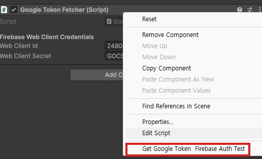

코드에 아까 저장한 클라이언트 ID 와 비밀번호 넣기
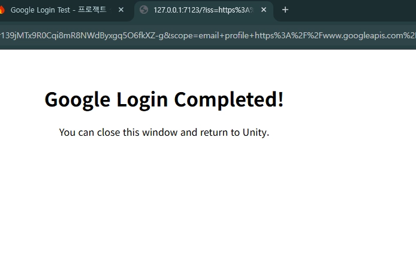

- 컨텍스메뉴로 실행


나는 로그인 성공 이력이 있어서 이런 화면이 뜨는데 
계정 로그인하면된다.

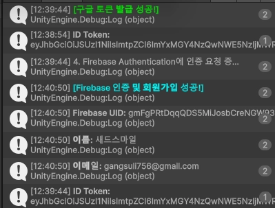

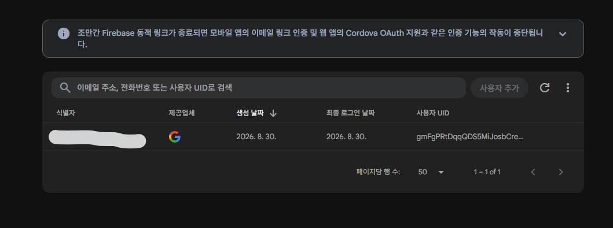

계정 생성 결과.